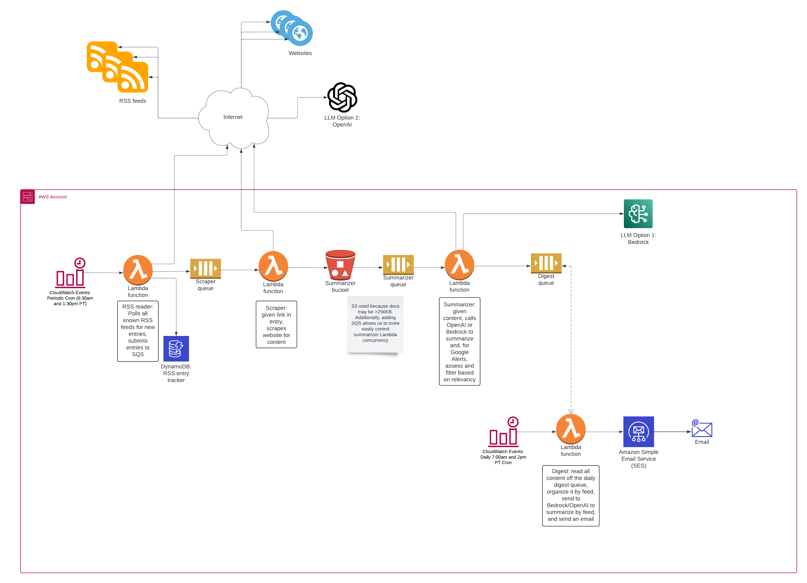

# README

image


## Development Setup

### Install Shared Package

Before working on any service, create a python venv, then install the shared utilities package in editable mode:

```sh
cd dailymail_shared_package
pip install -e .
```

This allows all services to import shared modules directly:
```python
from dailymail_shared.my_s3 import upload_file
from dailymail_shared.my_parameter_store import get_parameter
```

### Working on Services

After installing the shared package, you can work in any service directory and imports will work properly. Changes to shared code are immediately available without reinstalling.
