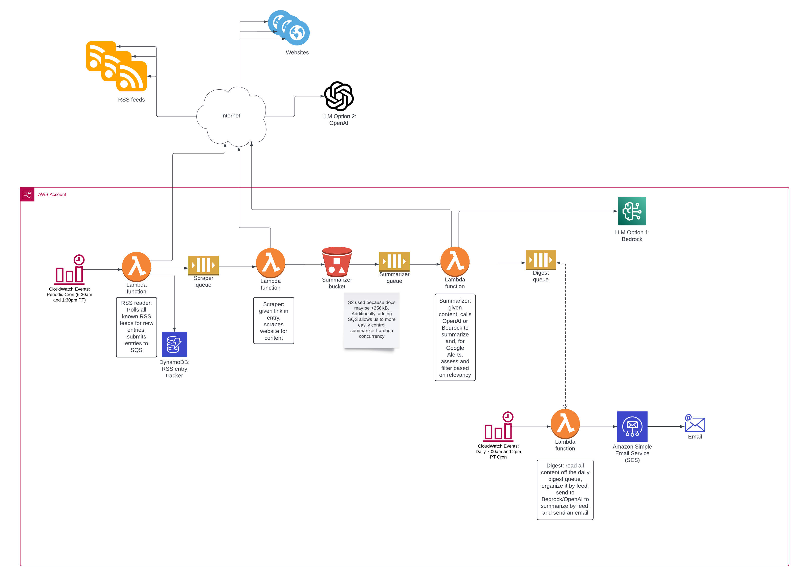

# README

image


## Development Setup

### Install the Project

Install `uv`, then sync the Python 3.13 environment from the lock file:

```sh
brew install uv
uv sync
```

Run commands inside that environment without activating it:

```sh
uv run python -m unittest discover -s tests -v
```

All Lambda stages and shared modules are installed from the root `src` directory. Imports such as these work across the project:

```python
from dailymail_shared.my_s3 import upload_file
from dailymail_shared.my_parameter_store import get_parameter
```

### Build the Lambda Image

Regenerate the deployment requirements after changing dependencies, then build
the shared Linux ARM64 image:

```sh
uv lock
uv export --locked --no-dev --no-emit-project --no-header --format requirements.txt --output-file requirements.txt
docker buildx build --platform linux/arm64 --provenance=false --load -t dailymail:py313-arm64 .
```

The image contains all four handlers. Lambda overrides its command per function
with one of `rss_reader.index.handler`, `scraper.index.handler`,
`summarizer.index.handler`, or `digest.index.handler`.

